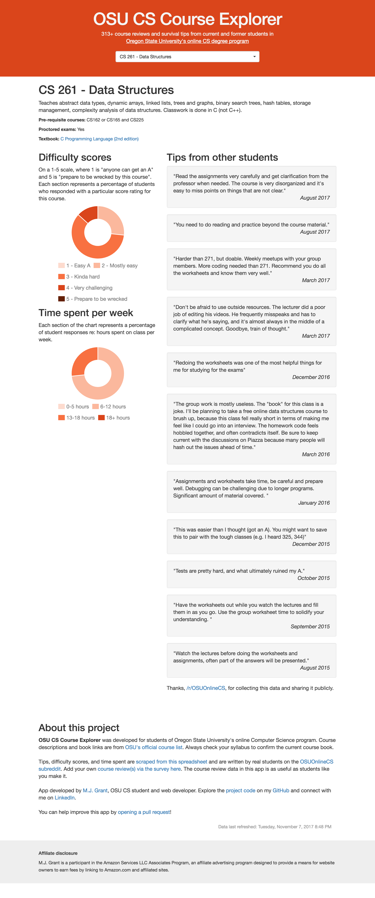

# OSU CS Course Explorer

Wondering how hard your next class might be? Did other students think CS162 was a bloodbath, too? This app can tell you!

The [OSU eCampus subreddit](https://www.reddit.com/r/OSUOnlineCS/) collects course reviews from real students into [this spreadsheet](https://docs.google.com/spreadsheets/d/1MFBGJbOXVjtThgj5b6K0rv9xdsC1M2GQ0pJVB-8YCeU/edit#gid=2042942971), but the spreadsheet is large and hard to navigate. This app lets you view individual course reviews and aggregates difficulty ratings and time spent.

This project was generated with the [Angular Full-Stack Generator](https://github.com/DaftMonk/generator-angular-fullstack) version 4.2.2.

# Development

## Prerequisites

- [Git](https://git-scm.com/)
- [Node.js and npm](nodejs.org) Node >= 4.x.x, npm >= 2.x.x
- [Gulp](http://gulpjs.com/) (`npm install --global gulp-cli`)

## Building & Running

Run `npm install` to install server dependencies.

Run `gulp build` for building and `gulp serve` for preview on localhost:3000.

Run `gulp buildcontrol:heroku` to deploy to Heroku.

## Testing

Run `npm test` to run the unit tests with karma.

&copy; 2017 Mandi Grant
