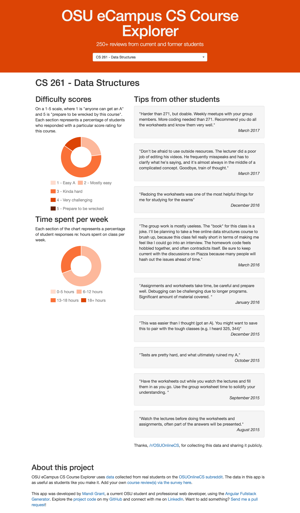

# osu-cs-class-explorer

Wondering how hard your next class might be? Did other students think CS162 was a bloodbath, too? This app can tell you!

The [OSU eCampus subreddit](https://www.reddit.com/r/OSUOnlineCS/) collects course reviews from real students into [this spreadsheet](https://docs.google.com/spreadsheets/d/1MFBGJbOXVjtThgj5b6K0rv9xdsC1M2GQ0pJVB-8YCeU/edit#gid=2042942971), but the spreadsheet is large and hard to navigate. This app lets you view individual course reviews and aggregates difficulty ratings and time spent.

This project was generated with the [Angular Full-Stack Generator](https://github.com/DaftMonk/generator-angular-fullstack) version 4.2.2.

# Development

## Prerequisites

- [Git](https://git-scm.com/)
- [Node.js and npm](nodejs.org) Node >= 4.x.x, npm >= 2.x.x
- [Gulp](http://gulpjs.com/) (`npm install --global gulp`)
- [SQLite](https://www.sqlite.org/quickstart.html)

### Developing

1. Run `npm install` to install server dependencies.

2. Run `gulp serve` to start the development server. It should automatically open the client in your browser when ready.

## Build & development

Run `gulp build` for building and `gulp serve` for preview on localhost:3000

## Testing

Running `npm test` will run the unit tests with karma.
